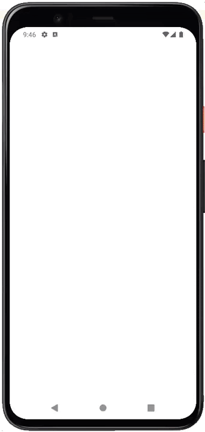

# Paging 3 from Network

Learn to use the paging 3 library to display data gradually in RecyclerView with the data source 
coming from the network or API service:

| Nama Project                  | My Unlimited Quotes            |
|-------------------------------|--------------------------------|
| Target & Minimum Target SDK   | Phone and Tablet, API level 21 |
| Tipe Activity                 | Empty Views Activity           | 
| Activity Name                 | MainActivity                   |
| Language                      | Kotlin                         |
| Build Configuration Language  | Kotlin DSL                     |

