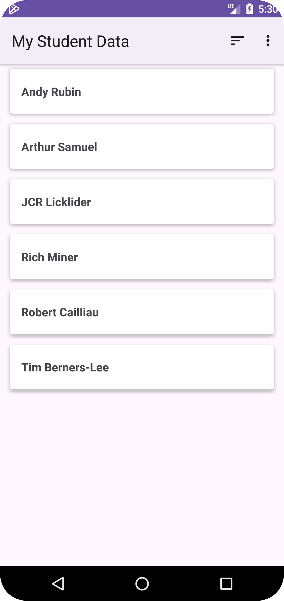

# Android Intermediate

This repository used for learning:

| Nama Project                  | Android Intermediate           |
|-------------------------------|--------------------------------|
| Target & Minimum Target SDK   | Phone and Tablet, API level 21 |
| Tipe Activity                 | Empty Views Activity           | 
| Activity Name                 | MainActivity                   |
| Language                      | Kotlin                         |
| Build Configuration Language  | Kotlin DSL                     |

[//]: # ()

## 📱 Advanced UI

This link contains a android for Advanced UI sources:

- [ui-customview: Creating Custom Buttons and EditText.](https://github.com/kisahtegar/Android_Intermediate/tree/ui-customview)
- [ui-customview-from-scratch: Creating a Custom View from Scratch.](https://github.com/kisahtegar/Android_Intermediate/tree/ui-customview-from-scratch)
- [ui-canvas: Practice with Canvas.](https://github.com/kisahtegar/Android_Intermediate/tree/ui-canvas)
- [ui-clipping-canvas: Clipping Object Canvas.](https://github.com/kisahtegar/Android_Intermediate/tree/ui-clipping-canvas)
- [ui-widgets: Widgets on Homepage.](https://github.com/kisahtegar/Android_Intermediate/tree/ui-widgets)
- [ui-stackwidget: StackView Widget.](https://github.com/kisahtegar/Android_Intermediate/tree/ui-stackwidget)
- [ui-webview: Displaying Websites with WebView.](https://github.com/kisahtegar/Android_Intermediate/tree/ui-webview)
