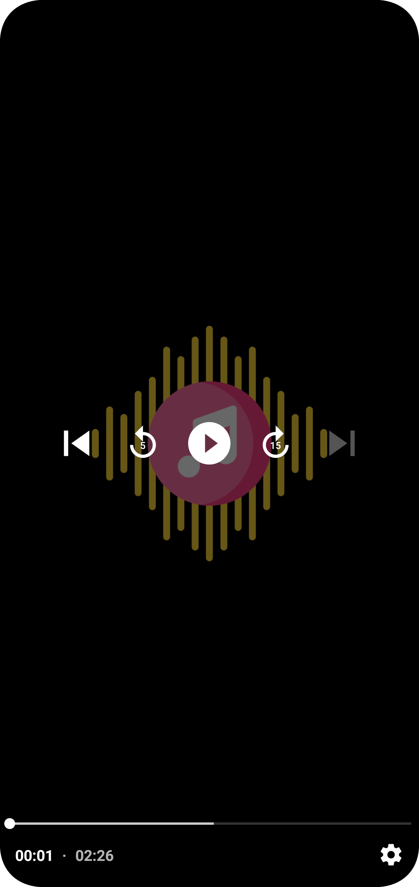

# Learn Property Animation

This repository used for learning:

| Nama Project                  | LoginWithAnimation             |
|-------------------------------|--------------------------------|
| Target & Minimum Target SDK   | Phone and Tablet, API level 21 |
| Tipe Activity                 | Empty Views Activity           | 
| Activity Name                 | MainActivity                   |
| Language                      | Kotlin                         |
| Build Configuration Language  | Kotlin DSL                     |

